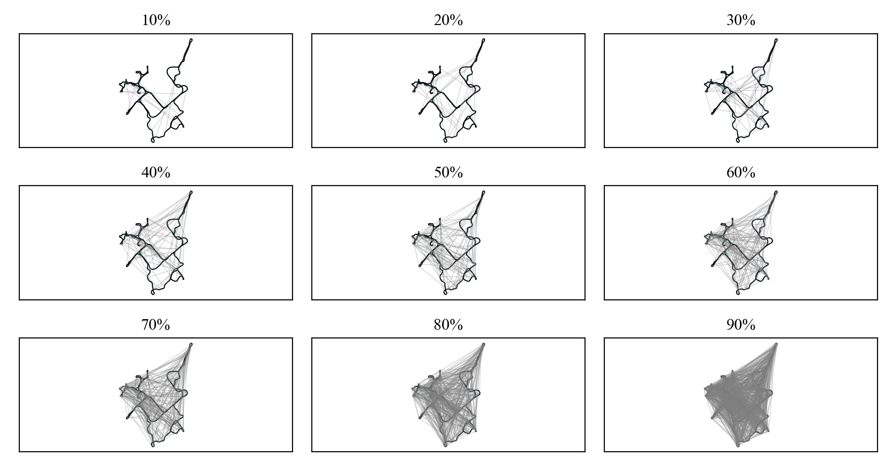
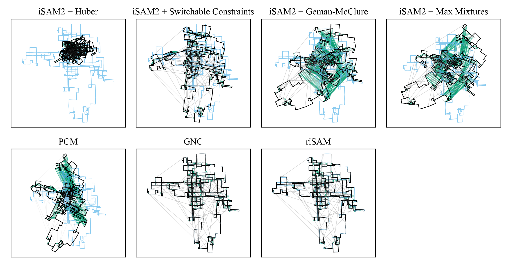

# Robust Incremental Smoothing and Mapping (riSAM)

 [](https://opensource.org/licenses/MIT)  &nbsp;[](https://rpl.ri.cmu.edu/)

This package contains the implementation of the robust incremental Smoothing and Mapping (riSAM) algorithm (see `risam/`) as presented in our ICRA 2023 paper. If you use this package please cite our paper:

```
@inproceedings{mcgann_risam_2023, 
    title = {Robust Incremental Smoothing and Mapping ({riSAM})},
    author = {D. McGann and J.G. Rogers III and M. Kaess},
    fullauthor = {Daniel McGann and John G. Rogers III and Michael Kaess},
    year = 2023,
    booktitle = {Proc. IEEE Intl. Conf. on Robotics and Automation (ICRA)},
    address = {London, {GB}}
    pages = {?--?}, % Note: To be determined
}
```

This paper can be accessed via [arXiv](https://arxiv.org/abs/2209.14359) and will soon be up on IEEE Explore.

riSAM is able to handle large amounts of outlier measurements (tested up to 90% outliers)
<p align="center">

</p>

More over riSAM is able to handle outlier measurements even with poor initialization. A situation in which prior works appear to struggle.
<p align="center">

</p>

# Structure
* `experiments`: Contains implementations of prior works, interface for running the experiments published in the riSAM paper, and scripts for working with datasets.
* `risam`: Contains the implementation of the riSAM algorithm.

Each of these subdirectories contains its own README with relevant information. If you want to get straight to running riSAM follow the installation directions below and then see the instructions in the `experiments` directory.

# Installation

First, one must setup dependencies. Unfortunately, there is a sensitivity to versioning due to the implementation of prior works These are detailed below.

## Known issues / Building Notes
* When using Kimera-RPGO w/ gtsam v4.1.1+ you may get a `std::out_of_range` in `std::map` from `gtsam::GaussianBayesTree::optimize`
    * Similar Issues Reported with RTABMap (https://github.com/borglab/gtsam/issues/1092#issue-1126734835)
    * [Fix](https://github.com/borglab/gtsam/pull/1158) uncluded in GTSAM pre-release [4.2a7+](https://github.com/borglab/gtsam/releases/tag/4.2a7)
* Kimera-RPGO requires a number of gtsam compile time options to be set. See the Kimera-RPGO repo for details.
* In older gtsam releases there was bug with the robust cost function loss in GTSAM. For details see the [issue](https://github.com/borglab/gtsam/issues/1129)
    * [Fix](https://github.com/borglab/gtsam/pull/1161) included in GTSAM [4.2a8+](https://github.com/borglab/gtsam/releases/tag/4.2a8)

## Building Instructions (Validated as of Mar 2023)
* Version Summary (tested and confirmed with the following dependency versions)
    * GTSAM: Tag=4.2a8, exact hash=9902ccc0a4f62123e91f057babe3612a95c15c20
    * KimeraRPGO: exact hash=8c5e163ba38345ff583d87403ad53bf966c0221b
    * dcsam: exact hash=b7f62295eec201fb00ee6d1d828fa551ac1f4bd7
* These should be checked out when the git submodules are initialized, but are included here for completeness

* GTSAM 
    * Download [GTSAM version 4.2a8](https://github.com/borglab/gtsam/releases/tag/4.2a8)
    * Setup compile time options [required by KimeraRPGO](https://github.com/MIT-SPARK/Kimera-RPGO)
    * Build and optionally install GTSAM (Scripts assume GTSAM python is installed in the active python environment)
* Clone riSAM and Submodules
    * [HTTPS]: `git clone --recurse-submodules https://github.com/rpl-cmu/risam.git`
    * [SSH]: `git clone --recurse-submodules git@github.com:rpl-cmu/risam.git`
* Link GTSAM
    * If you `install` GTSAM this should be automatic
    * If you are working with a local build of GTSAM set `GTSAM_DIR` and `GTSAM_INCLUDE_DIR` to the appropriate directories.
* Build riSAM and prior-works
    * `cd risam`
    * `mkdir build`
    * `cd build`
    * `cmake ..`
    * `make`
